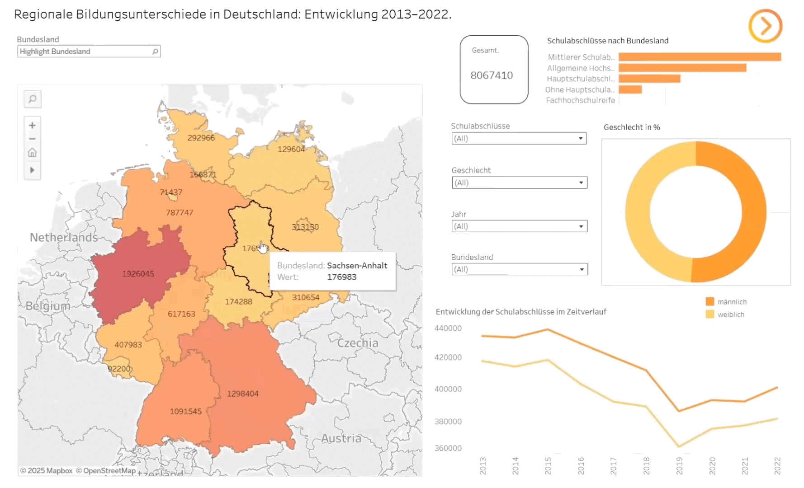
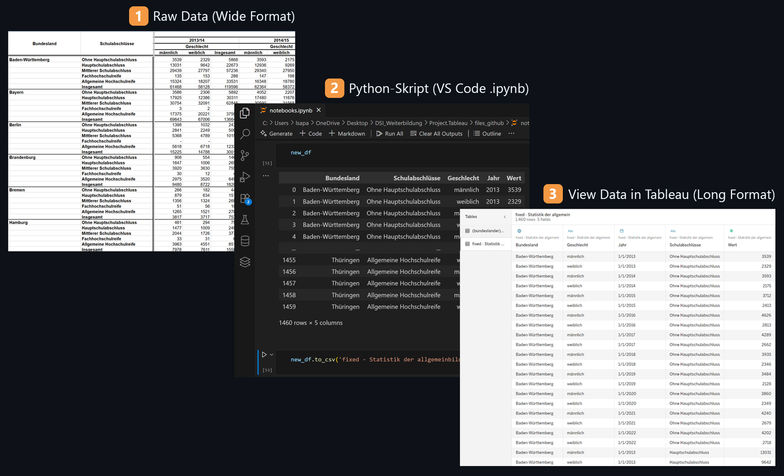
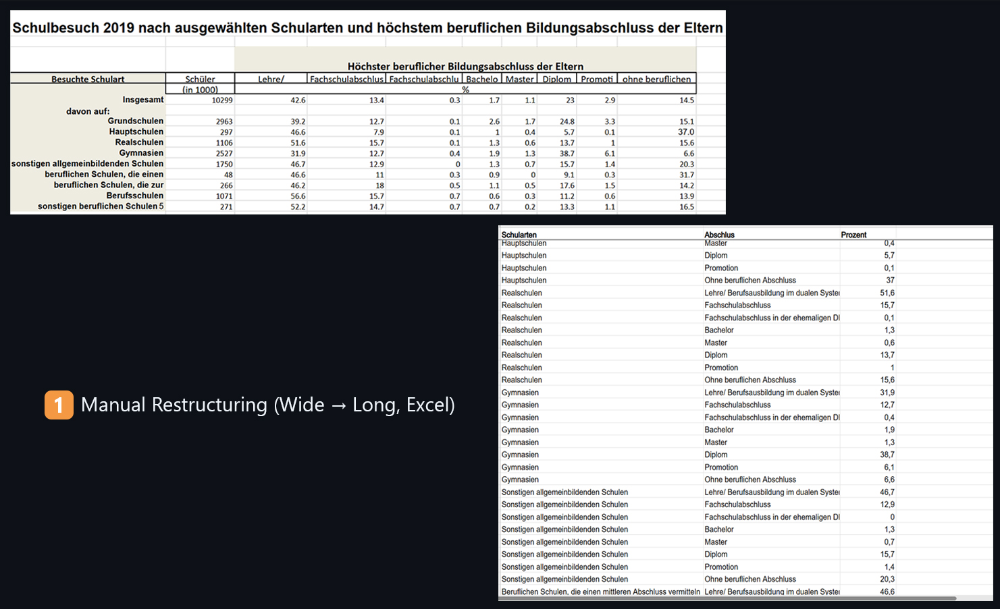

# 🎓 Educational Success — Data Visualization & Analysis

**Autor:** Liliia Rastorhuieva  
**Visualisierung:** Tableau  
**Technologien:** Tableau, Python, Excel  
**Status:** 📊 Abgeschlossen

---

## 📌 Projektbeschreibung

Dieses Projekt zeigt, wie Region, sozio-ökonomischer Status, Geschlecht und Migrationshintergrund den Bildungserfolg in Deutschland beeinflussen.  
Die Daten wurden in Excel vorbereitet und in Python (Pandas) bereinigt und normalisiert. Die fertigen Daten flossen dann in die interaktive Visualisierung mit Tableau ein.

---

## 🎬 Dashboard-Demo

> **Live-Ansicht:** [Hier klicken](https://public.tableau.com/views/BildungserfolginDeutschlandRegionalesozialeundmigrationsbedingteUngleichheiten_/RegionaleBildungsunterschiedeinDeutschlandEntwicklung20132022_?:language=en-US&:sid=&:redirect=auth&:display_count=n&:origin=viz_share_link)

---

## 💻 Mockup: Responsives Design

So sieht das Dashboard auf unterschiedlichen Geräten aus:

 

---

## 🧹 Datenvorbereitung & Normalisierung

Die Daten wurden aus Rohformaten bereinigt und transformiert — sowohl manuell als auch automatisiert:

- Rohdaten aus verschiedenen Quellen gesammelt  
- Aufbereitung & Transformation in Excel  
- Bereinigung, Filterung & Normalisierung in Python (Pandas)  
- Export in optimierte CSV-Dateien für Tableau  
- Validierung der Datenqualität vor Visualisierung  

- **Python-Skript für Normalisierung (Pandas):**  
  
  
- **Manuell in Longformat gebracht (Excel):**  
  

---

## 📊 Was zeigt das Dashboard?

- Einfluss von Region und Bundesland
- Sozio-ökonomischer Status & Schulerfolg
- Migrationshintergrund & Bildungswege
- Vergleich nach Geschlecht
- Interaktive Filter, Tooltips, Drilldowns

---

## 🗂️ Dateien im Repository

- `raw_data/` — Rohdaten
- `cleaned_data/` Normalisierungsdaten
- `notebooks.ipynb/` — Python-Skript für Datenbereinigung & Normalisierung
- `workbook.twbx/` — Tableau Workbook 
- `visual/` — Screenshots & GIF-Demos der wichtigsten Visualisierungen
- `README.md` — Projektbeschreibung

---

## ⚙️ Tech-Stack

- **Tableau** — Interaktive Dashboards
- **Python (Pandas)** — Automatisierte Datenbereinigung
- **Excel** — Manuelle Transformation & Kontrolle

---

## ✅ Projekt-Highlights

- Kombination von manueller & automatisierter Datenbearbeitung  
- Storytelling mit responsivem Tableau-Dashboard  
- Echtzeit-Filterung & Drilldowns  
- Klare Visualisierung komplexer Zusammenhänge  
- Praxisrelevanter Use-Case für Bewerbungen im Bereich Data Analytics & Visualization  

---

## 💡 Autor

**Liliia Rastorhuieva**  
📧 lilyrastorhuieva@gmail.com

---

